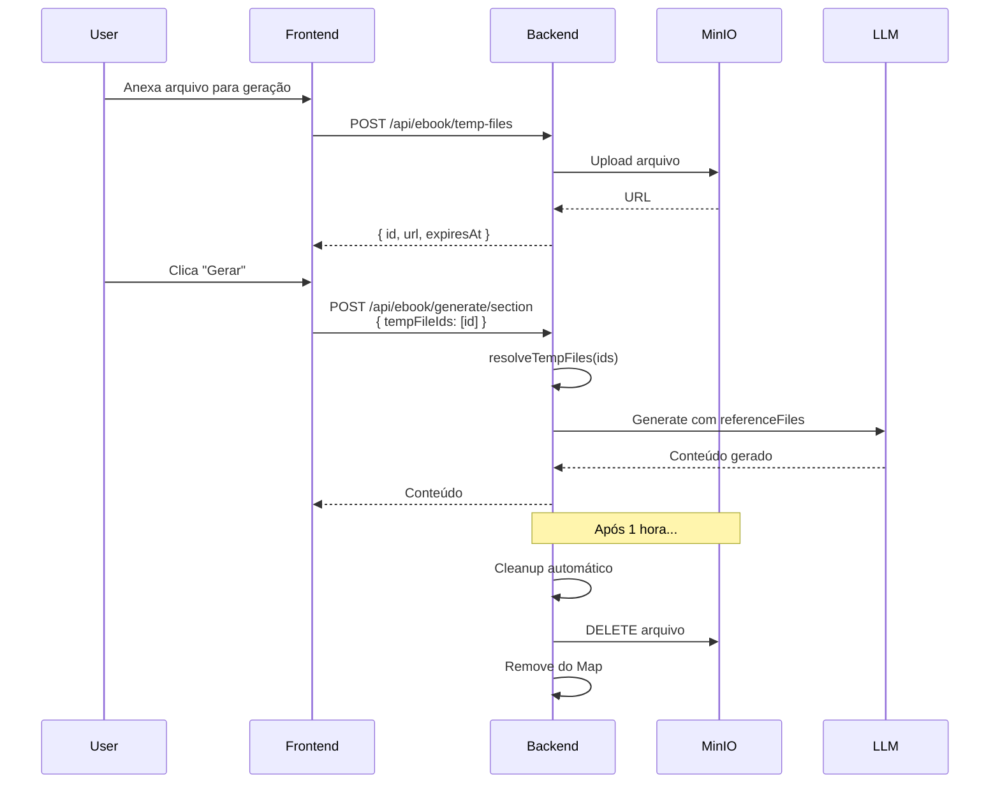

# Sistema de Upload Temporário de Arquivos

## 📋 Visão Geral

Sistema que permite uploads temporários de arquivos para uso durante a geração de conteúdo, sem armazená-los permanentemente no projeto. Ideal para anexos pontuais e referências de sessão específica.

## 🎯 Objetivo

Oferecer uma alternativa mais simples e rápida ao sistema de arquivos de referência do projeto, permitindo que usuários façam upload de arquivos "on-the-fly" durante a geração de capítulos sem a necessidade de gerenciamento permanente.

## 🆚 Comparação: Temporary Files vs Project Reference Files

| Aspecto | Temporary Files | Project Reference Files |
|---------|----------------|------------------------|
| **Duração** | 1 hora (auto-expire) | Permanente |
| **Escopo** | Sessão/Job específico | Projeto inteiro |
| **Citação** | Por ID | Por @alias |
| **Uso** | Upload pontual | Reutilização frequente |
| **Storage** | Em memória + MinIO | MongoDB + MinIO |
| **Cleanup** | Automático | Manual |

## 🏗️ Arquitetura

### Componentes Principais

1. **`TempFileController`** (`src/controllers/api/temp-file.controller.ts`)
   - Upload de arquivos temporários
   - Gerenciamento de metadados em memória
   - Cleanup automático de arquivos expirados

2. **Metadados em Memória**
   - `Map<fileId, TempFileMetadata>`
   - TTL de 1 hora por padrão
   - Cleanup automático a cada 15 minutos

3. **Storage MinIO**
   - Diretório: `temp-files/{userId}/{fileId}/`
   - Isolamento por usuário
   - Remoção física no cleanup

## 📡 Endpoints API

### 1. Upload de Arquivo Temporário

```http
POST /api/ebook/temp-files
Content-Type: multipart/form-data
Authorization: Bearer {token}

Body:
  - file: [arquivo]
```

**Resposta:**
```json
{
  "success": true,
  "file": {
    "id": "550e8400-e29b-41d4-a716-446655440000",
    "url": "https://minio.../temp-files/userId/fileId/documento.pdf",
    "name": "documento.pdf",
    "type": "pdf",
    "size": 102400,
    "expiresAt": "2024-11-27T04:00:00Z"
  },
  "message": "Arquivo temporário criado com sucesso. Expira em 1 hora(s)."
}
```

**Validações:**
- Tamanho máximo: 50MB
- Tipos aceitos: PDF, DOCX, imagens, vídeo, áudio
- Autenticação obrigatória

### 2. Upload em Lote (Batch)

```http
POST /api/ebook/temp-files/batch
Content-Type: multipart/form-data
Authorization: Bearer {token}

Body:
  - files: [arquivo1, arquivo2, ...]  (máx 10 arquivos)
```

**Resposta:**
```json
{
  "success": true,
  "files": [
    {
      "id": "...",
      "url": "...",
      "name": "documento1.pdf",
      "type": "pdf",
      "size": 102400,
      "expiresAt": "2024-11-27T04:00:00Z"
    },
    {
      "id": "...",
      "url": "...",
      "name": "imagem.png",
      "type": "image",
      "size": 52400,
      "expiresAt": "2024-11-27T04:00:00Z"
    }
  ],
  "errors": [
    {
      "name": "video_grande.mp4",
      "error": "File too large (75.5MB > 50MB)"
    }
  ],
  "count": 2,
  "message": "2 arquivo(s) temporário(s) criado(s) com sucesso."
}
```

### 3. Buscar Arquivo Temporário

```http
GET /api/ebook/temp-files/:fileId
Authorization: Bearer {token}
```

**Resposta:**
```json
{
  "success": true,
  "file": {
    "id": "550e8400-e29b-41d4-a716-446655440000",
    "url": "https://...",
    "name": "documento.pdf",
    "type": "pdf",
    "size": 102400,
    "uploadedAt": "2024-11-27T03:00:00Z",
    "expiresAt": "2024-11-27T04:00:00Z"
  }
}
```

**Erros:**
- `404`: Arquivo não encontrado ou expirado
- `403`: Acesso negado (outro usuário)
- `410`: Arquivo expirado (Gone)

### 4. Remover Arquivo Temporário

```http
DELETE /api/ebook/temp-files/:fileId
Authorization: Bearer {token}
```

**Resposta:**
```json
{
  "success": true,
  "message": "Temporary file deleted successfully"
}
```

## 🔧 Como Funciona

### 1. Fluxo de Upload

```typescript
// Frontend: Usuário faz upload
const formData = new FormData();
formData.append('file', fileBlob);

const response = await fetch('/api/ebook/temp-files', {
  method: 'POST',
  headers: { 'Authorization': `Bearer ${token}` },
  body: formData
});

const { file } = await response.json();
// file.id = "550e8400-..."
// file.expiresAt = "2024-11-27T04:00:00Z"
```

### 2. Uso na Geração

```typescript
// Frontend: Envia tempFileIds para geração
await generationService.generateContent({
  projectId: '123',
  sectionId: '456',
  tempFileIds: ['550e8400-...', '7f3b2c1a-...'],  // ← IDs dos arquivos temporários
  customPrompt: 'Gere capítulo usando os arquivos anexados'
});

// Backend: Resolve IDs → URLs
import { resolveTempFiles } from '../controllers/api/temp-file.controller';

const tempFiles = await resolveTempFiles(req.body.tempFileIds, userId);
// [
//   { url: "...", type: "pdf", name: "doc.pdf" },
//   { url: "...", type: "image", name: "img.png" }
// ]

// Passar para LLM
await llm.generate({
  prompt: customPrompt,
  referenceFiles: tempFiles  // ← Arquivos temporários
});
```

### 3. Cleanup Automático

```typescript
// Sistema executa a cada 15 minutos
setInterval(async () => {
  const cleanedCount = await cleanupExpiredFiles();
  console.log(`🧹 ${cleanedCount} arquivos expirados removidos`);
}, 15 * 60 * 1000);

// cleanupExpiredFiles() verifica:
// - Se expiresAt < now
// - Remove do MinIO
// - Remove do Map em memória
```

## 🎨 Casos de Uso

### 1. Upload Rápido Durante Geração

**Cenário:** Usuário está gerando um capítulo e quer anexar um documento de referência pontual.

```javascript
// 1. Upload do arquivo
const { file } = await uploadTempFile(pdfFile);

// 2. Usar na geração
await generateSection({
  projectId,
  sectionId,
  tempFileIds: [file.id],
  customPrompt: 'Gere capítulo baseado no documento anexado'
});

// 3. Arquivo é automaticamente removido após 1 hora
```

### 2. Anexo de Múltiplos Arquivos

**Cenário:** Usuário quer gerar capítulo usando várias imagens de referência.

```javascript
// 1. Upload em lote
const { files } = await uploadTempFiles([img1, img2, img3]);

// 2. Usar na geração
await generateSection({
  projectId,
  sectionId,
  tempFileIds: files.map(f => f.id),
  customPrompt: 'Gere capítulo descrevendo estas imagens'
});
```

### 3. Comparação com Projeto Reference Files

**Quando usar Temporary Files:**
- ✅ Arquivo usado uma única vez
- ✅ Referência pontual/experimental
- ✅ Não quer poluir arquivos do projeto
- ✅ Upload rápido sem alias

**Quando usar Project Reference Files:**
- ✅ Arquivo usado em múltiplas gerações
- ✅ Guia de estilo permanente
- ✅ Quer citar com @alias
- ✅ Organização de longo prazo

## 📊 Estrutura de Dados

### TempFileMetadata (em memória)

```typescript
interface TempFileMetadata {
  id: string;              // UUID v4
  url: string;             // MinIO URL
  name: string;            // Nome original
  type: 'pdf' | 'docx' | 'image' | 'video' | 'audio';
  size: number;            // Bytes
  uploadedAt: Date;        // Data de upload
  expiresAt: Date;         // Data de expiração (uploadedAt + 1h)
  userId: string;          // Ownership
}
```

### Storage Map

```typescript
const tempFiles = new Map<string, TempFileMetadata>();

// Exemplo:
tempFiles.set('550e8400-...', {
  id: '550e8400-...',
  url: 'https://minio.../temp-files/user123/550e8400-.../doc.pdf',
  name: 'doc.pdf',
  type: 'pdf',
  size: 102400,
  uploadedAt: new Date('2024-11-27T03:00:00Z'),
  expiresAt: new Date('2024-11-27T04:00:00Z'),
  userId: 'user123'
});
```

## ⚡ Performance

### Otimizações

1. **Storage em Memória**
   - Acesso O(1) via Map
   - Sem necessidade de DB queries
   - Ideal para dados efêmeros

2. **Cleanup Automático**
   - Executa a cada 15 minutos
   - Remove arquivos expirados do MinIO
   - Libera memória

3. **Batch Upload**
   - Suporta até 10 arquivos simultâneos
   - Validação individual
   - Continua mesmo se alguns falharem

### Limitações

- **Memória:** Metadados em memória podem ser perdidos se servidor reiniciar
  - **Solução futura:** Migrar para Redis para persistência
- **Escalabilidade:** Map compartilhado entre instâncias
  - **Solução futura:** Usar Redis Cluster

## 🔒 Segurança

### Controles de Acesso

- ✅ Autenticação obrigatória em todos endpoints
- ✅ Ownership verificado (userId)
- ✅ Isolamento de storage por usuário
- ✅ Validação de tamanho (50MB)
- ✅ Expiração forçada (1 hora)

### Validações

```typescript
// Ownership
if (metadata.userId !== userId) {
  return res.status(403).json({ error: 'Access denied' });
}

// Expiração
if (new Date() > metadata.expiresAt) {
  tempFiles.delete(fileId);
  return res.status(410).json({ error: 'File expired' });
}

// Tamanho
if (file.size > 50MB) {
  return res.status(400).json({ error: 'File too large' });
}
```

## 🔌 Integração com Geração

### Modificações nos Endpoints de Geração

Os endpoints de geração (generateSection, expandText, etc.) devem aceitar `tempFileIds`:

```typescript
// Exemplo em generateSection
export const generateSection = async (req: Request, res: Response) => {
  const { projectId, sectionId, tempFileIds, customPrompt } = req.body;
  const userId = (req as any).user.id;
  
  // 1. Resolver arquivos temporários
  const tempFiles = await resolveTempFiles(tempFileIds || [], userId);
  
  // 2. Parsear referências do projeto (@alias)
  const projectFiles = await parseProjectReferences(projectId, userId, customPrompt);
  
  // 3. Combinar ambos
  const allFiles = [...projectFiles, ...tempFiles];
  
  // 4. Passar para LLM
  await addJob({
    form: {
      projectId,
      sectionId,
      referenceFiles: allFiles  // ← Combinação
    }
  });
};
```

## 📈 Métricas e Monitoramento

### Logs

```typescript
// Upload
console.log(`✅ Arquivo temporário criado: ${tempFileId} (expira em 1h)`);

// Acesso negado
console.warn(`⚠️  Acesso negado ao arquivo temporário: ${fileId}`);

// Expiração
console.warn(`⚠️  Arquivo temporário expirado: ${fileId}`);

// Cleanup
console.log(`🧹 Limpeza automática: ${cleanedCount} arquivo(s) removido(s)`);
```

### Métricas Possíveis

- Total de uploads temporários por usuário
- Taxa de uso (quantos são usados vs quantos expiram sem uso)
- Tamanho médio de arquivos temporários
- Tempo médio até expiração

## 🚀 Benefícios

### Para o Usuário

1. ✅ Upload rápido sem precisar gerenciar aliases
2. ✅ Não polui arquivos permanentes do projeto
3. ✅ Ideal para testes e experimentação
4. ✅ Limpeza automática (não precisa remover manualmente)

### Para o Sistema

1. ✅ Reduz carga no MongoDB (dados efêmeros em memória)
2. ✅ Cleanup automático libera storage
3. ✅ Isolamento de storage por usuário
4. ✅ Menos complexidade de gerenciamento

## 🔄 Fluxo Completo: Frontend → Backend



## 📝 Exemplo Completo

### Frontend (TypeScript/Angular)

```typescript
// Serviço de upload temporário
async uploadTempFile(file: File): Promise<TempFile> {
  const formData = new FormData();
  formData.append('file', file);
  
  const response = await this.http.post<{ file: TempFile }>(
    '/api/ebook/temp-files',
    formData
  ).toPromise();
  
  return response.file;
}

// Uso no componente
async onGenerateWithAttachment() {
  // 1. Upload arquivos anexados
  const tempFileIds: string[] = [];
  for (const file of this.attachedFiles) {
    const tempFile = await this.uploadTempFile(file);
    tempFileIds.push(tempFile.id);
  }
  
  // 2. Gerar com arquivos
  await this.generationService.generateContent({
    projectId: this.projectId,
    sectionId: this.sectionId,
    tempFileIds: tempFileIds,
    customPrompt: this.prompt
  });
}
```

### Backend (TypeScript/Express)

```typescript
// No endpoint de geração
const { tempFileIds } = req.body;

// Resolver IDs → arquivos
const tempFiles = await resolveTempFiles(tempFileIds || [], userId);

// Combinar com arquivos do projeto
const projectFiles = await parseProjectReferences(projectId, userId, prompt);
const allFiles = [...projectFiles, ...tempFiles];

// Passar para LLM
await generateWithFiles({
  prompt,
  referenceFiles: allFiles
});
```

## 🎯 Conclusão

Sistema completo e funcional que:
- ✅ Permite uploads temporários sem gerenciamento permanente
- ✅ Expira automaticamente após 1 hora
- ✅ Cleanup automático libera recursos
- ✅ Complementa (não substitui) o sistema de Project Reference Files
- ✅ Ideal para uploads pontuais e experimentação
- ✅ Seguro e isolado por usuário

---

**Documentação gerada em:** 27/11/2024  
**Versão:** 1.0.0
